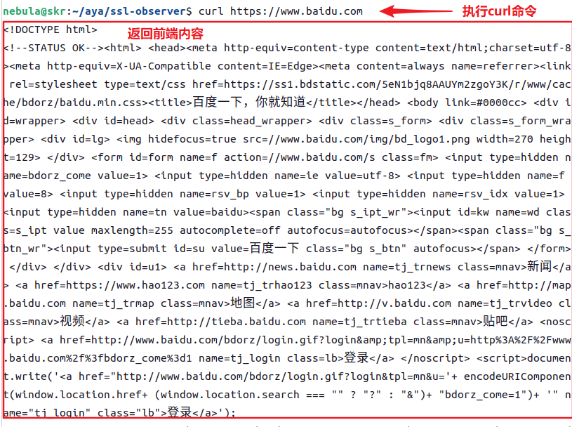

# ssl-observer

SSL-Observer 是基于 eBPF 技术构建的网络监控工具，专门设计用于观测 SSL 加密流量。它通过用户探针（user probes）挂钩 SSL 库中的加解密函数，不用配置 SSL 证书就能够实时捕获加密前或解密后的流量明文，为用户提供深入的流量分析和安全检测能力。

## 功能

- [x] 观测 SSL 流量明文数据
- [ ] 支持观测的库
  - [x] OpenSSL
  - [x] NSS
- [x] 指定`.so`库文件
- [ ] HTTP 报文解压缩
  - [x] Gzip
  - [ ] Br
- [ ] 支持的数据库
  - [x] Mysql
  - [ ] Sqlite
- [x] 简单的 UI 界面
- [x] Toml 配置文件

## 技术原理

### eBPF


eBPF 是一种革新的内核编程技术，允许开发者在 Linux 内核的沙盒环境中运行自定义程序，从而安全高效地扩展内核功能，且并非以更改内核源代码或加载内核模块的方式的实现。


如上图所示，eBPF的工作流程有以下几步：


（1）eBPF程序通过LLVM/GCC编译器编译成eBPF字节码。


（2）eBPF加载器进程通过bpf()系统调用加载进入内核空间，然后验证器将检验其安全性，确保该程序不会造成系统崩溃或者其他有害后果。


（3）通过验证之后，JIT编译器将eBPF字节码转译成本地机器码，若内核不支持JIT，则需要eBPF虚拟机先将中间码解析成机器码，这会消耗更多的CPU资源。


（4）eBPF程序附加到追踪点或系统事件上，等待进程触发。


（5）当进程触发事件时，运行eBPF程序。


（6）用户空间程序通过bpf()系统调用对eBPF Map进行操作，提供用户空间与内核空间进行交互的功能。

### uprobe

uprobe是一种用户空间探针，uprobe探针允许在用户空间程序中动态插桩，插桩位置包括：函数入口、特定偏移处，以及函数返回处。当我们定义uprobe时，内核会在附加的指令上创建快速断点指令（x86机器上为int3指令），当程序执行到该指令时，内核将触发事件，程序陷入到内核态，并以回调函数的方式调用探针函数，执行完探针函数再返回到用户态继续执行后序的指令。

### ssl-observer


如上图所示，用户探针和用户返回探针分别挂钩（Hook）在SSL_read和SSL_write函数上，这两个函数是OpenSSL库中用于处理SSL/TLS会话的核心函数，其中SSL_read函数负责从SSL/TLS通道读取数据并进行解密，SSL_write函数则负责将数据加密后发送。在这些函数中，第二个参数buf是一个关键的指针，它指向了即将被加密或已解密的数据缓冲区。


通过用户探针，我们能够捕获SSL_read和SSL_write函数的参数，包括指向数据缓冲区buf的地址。捕获到的buf地址随后被存储在一个哈希映射（Hash Map）中，一旦buf地址被捕获并存储，随即从哈希映射中取出该地址，并调用bpf_probe__read_user()这个辅助函数。此函数的作用是从用户空间读取buf地址对应的数据。读取到的数据随后将存入一个环形缓冲区（Ring Buffer）中。


接着跟踪程序将持续轮询环形缓冲区，直到所需的数据到达。一旦数据到达，程序将对数据进行进一步的处理。

## 实验环境

Linux：测试环境 Ubuntu 22.04，只需内核版本大于等于 4.1（因 Lru Hash），详见：https://github.com/iovisor/bcc/blob/master/docs/kernel-versions.md

Rust :  Rust 的 eBPF 库——[Aya](https://github.com/aya-rs/aya) 。

mysql ：存储 SSL 明文流量与相关数据。

[Golang + Python]：测试、评估功能和性能。

## 开发环境

1. 配置 Rust 环境与安装必要的库。

注1：cargo 安装 bpf-linker 的前置库`build-essential`。

注2：cargo 安装 cargo-generate 的前置库`libssl-dev`。

```shell
sudo apt update 
sudo apt install -y curl git build-essential libssl-dev

export RUSTUP_DIST_SERVER="https://rsproxy.cn"
export RUSTUP_UPDATE_ROOT="https://rsproxy.cn/rustup"
curl --proto '=https' --tlsv1.2 -sSf https://sh.rustup.rs | sh
# 刷新环境变量
source $HOME/.cargo/env
# 换源
sudo gedit ~/.cargo/config.toml
===============================
[source.crates-io]
replace-with = 'rsproxy-sparse'
[source.rsproxy]
registry = "https://rsproxy.cn/crates.io-index"
[source.rsproxy-sparse]
registry = "sparse+https://rsproxy.cn/index/"
[registries.rsproxy]
index = "https://rsproxy.cn/crates.io-index"
[net]
git-fetch-with-cli = true
===============================

# aya
rustup install stable
rustup toolchain install nightly --component rust-src
cargo install bpf-linker
cargo install cargo-generate

# mysql
sudo apt install mysql-server
sudo mysql -uroot
ALTER USER 'root'@'localhost' IDENTIFIED WITH mysql_native_password BY 'root';
FLUSH PRIVILEGES;
create database ssl_data;
exit
```

2. 下载

```shell
git clone https://github.com/N3bu74/ssl-observer
cd ssl-observer
```

## 使用方法

直接运行 or 编译。（需要 root 权限）

注1：运行以及编译都需要一定额外的硬盘存储空间。

注2：按下 `ctrl + c` 结束程序，可能需多按下。

```bash
// 直接运行
sh run.sh
// 编译
sh release.sh
```

## measure

进行并发请求测试，并记录数据。（需要 Golang 环境）

```bash
// 首先在 measure.go 中配置常量参数
go run measure.go
```

## evaluate

对测试数据进行评估。（需要 Python 环境）

```bash
pip install -r requirement.txt
python evaluate.py
```

## 测试

|  |  |  |
| :-------------------------------------: | :-----------------------------------------: | :---------------------------: |
|        curl 工具发起 HTTPS 请求         |            ssl-observer 执行情况            |            UI 界面            |

## 参考

https://eunomia.dev/zh/tutorials/5-uprobe-bashreadline/

https://github.com/iovisor/bcc/blob/master/tools/sslsniff.py

https://github.com/mbulhakov/ssl-injector

https://github.com/vadorovsky/aya-examples/tree/main

https://github.com/SuzumiyaAsahi/ebpf-xdp-rust-aya

## 开发日志

### v0.0.1

1. 实现了对 SSL 加密流量的明文还原，但一次还原只对应一次加解密操作，未能做到一次还原一个数据包。
2. 可同时观测请求报文和响应报文内容。
3. 默认还原经过 OpenSSL 库加解密的流量（如 curl），同时也可还原 NSS 库（如火狐浏览器）加解密的流量。
4. HTTP 报文解压缩目前只适配了 Gzip 。
5. 简单的 UI 界面。
